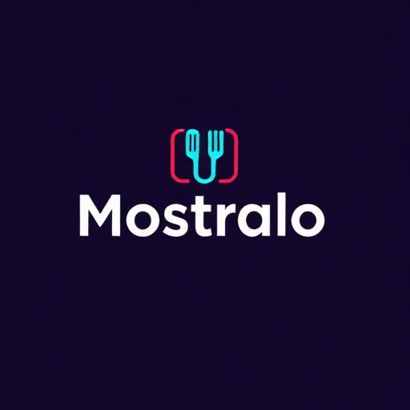

# 🍽️ Mostralo - Cardápios Digitais



> Plataforma completa para criar e gerenciar cardápios digitais para restaurantes. Aumente suas vendas e melhore a experiência dos seus clientes com integração WhatsApp, sistema de pedidos em tempo real e muito mais.

## 📋 Índice

- [Sobre o Projeto](#sobre-o-projeto)
- [Funcionalidades](#funcionalidades)
- [Tecnologias](#tecnologias)
- [Pré-requisitos](#pré-requisitos)
- [Instalação](#instalação)
- [Configuração](#configuração)
- [Scripts Disponíveis](#scripts-disponíveis)
- [Estrutura do Projeto](#estrutura-do-projeto)
- [PWA e Notificações](#pwa-e-notificações)
- [Autenticação e Permissões](#autenticação-e-permissões)
- [Contribuindo](#contribuindo)

## 🎯 Sobre o Projeto

**Mostralo** é uma solução moderna e escalável para restaurantes que desejam digitalizar seus cardápios e gerenciar pedidos de forma eficiente. A plataforma oferece:

- 📱 **PWA Instalável** - Funciona como aplicativo nativo em qualquer dispositivo
- 🔔 **Notificações em Tempo Real** - Alertas instantâneos de novos pedidos
- 🗺️ **Sistema de Delivery** - Integração com mapas para gestão de entregas
- 💬 **WhatsApp Business** - Comunicação direta com clientes
- 📊 **Analytics Avançados** - Relatórios e métricas de vendas
- 🎨 **Personalização Completa** - Customize cores, logo e tema do cardápio

## ✨ Funcionalidades

### Gestão de Produtos
- ✅ Cadastro completo de produtos com imagens
- ✅ Organização por categorias
- ✅ Controle de estoque e disponibilidade
- ✅ Preços e variações (tamanhos, sabores, complementos)
- ✅ Upload e otimização automática de imagens

### Sistema de Pedidos
- ✅ Recebimento de pedidos em tempo real
- ✅ Painel de delivery com status atualizáveis
- ✅ Notificações sonoras personalizáveis
- ✅ Histórico completo de pedidos
- ✅ Impressão de pedidos

### Delivery e Mapas
- ✅ Integração com Mapbox
- ✅ Definição de áreas de entrega
- ✅ Cálculo automático de taxas por região
- ✅ Rastreamento de entregas

### Multi-tenant
- ✅ Suporte para múltiplos restaurantes
- ✅ Sistema de permissões granular (Master Admin, Store Admin, Cliente)
- ✅ Isolamento completo de dados entre estabelecimentos
- ✅ Personalização por estabelecimento

### Experiência do Cliente
- ✅ Cardápio digital responsivo e moderno
- ✅ Busca e filtros avançados
- ✅ Carrinho de compras intuitivo
- ✅ Checkout simplificado
- ✅ Compartilhamento direto via WhatsApp

## 🚀 Tecnologias

### Frontend
- **[React 18](https://react.dev/)** - Biblioteca JavaScript para interfaces
- **[TypeScript](https://www.typescriptlang.org/)** - Superset tipado do JavaScript
- **[Vite](https://vitejs.dev/)** - Build tool moderna e rápida
- **[Tailwind CSS](https://tailwindcss.com/)** - Framework CSS utility-first
- **[Shadcn/ui](https://ui.shadcn.com/)** - Componentes reutilizáveis e acessíveis
- **[Radix UI](https://www.radix-ui.com/)** - Componentes primitivos sem estilo
- **[React Router DOM v6](https://reactrouter.com/)** - Roteamento declarativo
- **[TanStack Query](https://tanstack.com/query)** - Gerenciamento de estado servidor

### Backend & Serviços
- **[Supabase](https://supabase.com/)** - Backend-as-a-Service
  - Authentication (JWT + RLS)
  - PostgreSQL Database
  - Storage para imagens
  - Edge Functions
  - Realtime subscriptions

### Mapas & Geolocalização
- **[Mapbox GL](https://www.mapbox.com/)** - Mapas interativos
- **[Turf.js](https://turfjs.org/)** - Análise espacial

### UI & UX
- **[Lucide React](https://lucide.dev/)** - Ícones modernos
- **[Recharts](https://recharts.org/)** - Gráficos e visualizações
- **[React Beautiful DnD](https://github.com/atlassian/react-beautiful-dnd)** - Drag and drop
- **[Sonner](https://sonner.emilkowal.ski/)** - Toast notifications
- **[React Hook Form](https://react-hook-form.com/)** - Gerenciamento de formulários
- **[Zod](https://zod.dev/)** - Validação de schemas

### Desenvolvimento
- **[ESLint](https://eslint.org/)** - Linting de código
- **[PostCSS](https://postcss.org/)** - Transformação de CSS
- **[Vite PWA](https://vite-pwa-org.netlify.app/)** - Progressive Web App

## 📦 Pré-requisitos

Antes de começar, certifique-se de ter instalado:

- **Bun** >= 1.2.0 ou **Node.js** >= 18.0.0
- **Git**
- Conta no **[Supabase](https://supabase.com/)** (gratuita)
- Conta no **[Mapbox](https://www.mapbox.com/)** (gratuita)

> 💡 **Nota**: Este projeto utiliza **Bun** como gerenciador de pacotes padrão por sua velocidade superior. Você também pode usar npm/yarn/pnpm se preferir.

## 🔧 Instalação

1. **Clone o repositório**
```bash
git clone https://github.com/seu-usuario/mostralo.git
cd .mostralo
```

2. **Instale as dependências**
```bash
# Recomendado: Bun (mais rápido)
bun install

# Alternativas
npm install
# ou
yarn install
# ou
pnpm install
```

3. **Configure as variáveis de ambiente**
```bash
# Crie o arquivo .env na raiz do projeto
cp .env.example .env
```

## ⚙️ Configuração

### Variáveis de Ambiente

Edite o arquivo `.env` com suas credenciais:

```env
# Supabase
VITE_SUPABASE_URL=sua_url_do_supabase
VITE_SUPABASE_ANON_KEY=sua_chave_anonima_do_supabase

# Mapbox
VITE_MAPBOX_TOKEN=seu_token_do_mapbox

# WhatsApp (Opcional)
VITE_WHATSAPP_BUSINESS_ID=seu_id_whatsapp_business
```

### Configuração do Supabase

1. Crie um novo projeto no [Supabase](https://supabase.com/)
2. Execute as migrations em `supabase/migrations/`
3. Configure as políticas RLS (Row Level Security)
4. Ative o Realtime para as tabelas necessárias
5. Configure o Storage para upload de imagens

Para mais detalhes, consulte: [CRIAR_USUARIOS_REAIS.md](./CRIAR_USUARIOS_REAIS.md)

## 🎮 Scripts Disponíveis

```bash
# Desenvolvimento (localhost:8080)
bun run dev

# Build para produção
bun run build

# Build para desenvolvimento (com variáveis de dev)
bun run build:dev

# Preview da build
bun run preview

# Linting
bun run lint
```

> 💡 Substitua `bun` por `npm`, `yarn` ou `pnpm` se não estiver usando Bun.

## 📁 Estrutura do Projeto

```
.mostralo/
├── public/                    # Assets estáticos
│   ├── sounds/               # Sons de notificação (8 arquivos)
│   ├── favicon.png           # Ícone da aplicação
│   ├── manifest.json         # Manifest PWA
│   ├── sw.js                 # Service Worker
│   └── placeholder.svg
├── src/
│   ├── components/           # ~200 componentes React
│   │   ├── ui/              # 49 componentes Shadcn/ui (base)
│   │   ├── admin/           # 83+ componentes administrativos
│   │   │   ├── delivery/    # 12 arquivos - gestão de entregadores
│   │   │   ├── orders/      # 14 arquivos - gestão de pedidos
│   │   │   ├── print/       # 4 arquivos - sistema de impressão
│   │   │   ├── reports/     # 8 arquivos - relatórios e analytics
│   │   │   ├── scheduled-orders/ # 5 arquivos - pedidos agendados
│   │   │   └── store-config/     # 12 arquivos - configurações
│   │   ├── delivery/        # 26 componentes para entregadores
│   │   ├── checkout/        # 13 componentes do fluxo de compra
│   │   └── customer/        # Componentes do cliente
│   ├── pages/               # 50+ páginas da aplicação
│   │   ├── admin/           # 28 páginas administrativas
│   │   ├── Auth.tsx         # Autenticação de admins
│   │   ├── CustomerAuth.tsx # Autenticação de clientes
│   │   ├── Store.tsx        # Cardápio público
│   │   └── ...
│   ├── hooks/               # 18 custom hooks
│   │   ├── use-auth.tsx     # Auth completa + impersonation
│   │   ├── useStoreAccess.tsx
│   │   ├── useOrderTracking.ts
│   │   ├── useDriverEarnings.ts
│   │   └── ...
│   ├── contexts/            # React Contexts
│   │   └── CartContext.tsx  # Carrinho de compras
│   ├── utils/               # 11 utilitários
│   │   ├── addressFormatter.ts
│   │   ├── deliveryZoneValidation.ts
│   │   ├── driverEarnings.ts
│   │   ├── printOrder.ts
│   │   ├── promotionCalculator.ts
│   │   ├── soundPlayer.ts
│   │   └── ...
│   ├── types/               # TypeScript types
│   │   ├── print.ts
│   │   └── promotions.ts
│   ├── lib/                 # Configurações de libs
│   │   ├── utils.ts         # Utilitários gerais (cn, formatPhone)
│   │   ├── chatwootWidget.ts
│   │   └── advertisingScripts.ts
│   ├── integrations/        # Integrações externas
│   │   └── supabase/
│   │       ├── client.ts    # Cliente Supabase
│   │       └── types.ts     # Tipos do banco
│   ├── config/              # Configurações
│   │   └── orderTimings.ts  # Thresholds de tempo
│   ├── App.tsx              # Componente principal + rotas
│   ├── main.tsx             # Entry point
│   ├── index.css            # Estilos globais + themes
│   └── App.css              # Estilos do App
├── supabase/
│   ├── migrations/          # 109 migrations SQL
│   ├── functions/           # 14 Edge Functions
│   │   ├── customer-auth/
│   │   ├── driver-self-register/
│   │   ├── generate-monthly-invoices/
│   │   └── ...
│   └── config.toml          # Configuração do Supabase
├── rules/                   # Documentação de padrões (9 arquivos)
│   ├── React.mdc
│   ├── TypeScript.mdc
│   ├── Supabase.mdc
│   ├── Performance.mdc
│   └── ...
├── index.html               # HTML principal
├── vite.config.ts           # Configuração do Vite + PWA
├── tailwind.config.ts       # Configuração do Tailwind
├── tsconfig.json            # Configuração do TypeScript
├── package.json             # Dependências
├── bun.lockb                # Lockfile do Bun
└── README.md                # Este arquivo
```

### 📊 Estatísticas do Projeto

- **~200 componentes** React reutilizáveis
- **50+ páginas** de aplicação
- **18 custom hooks** especializados
- **35 tabelas** no banco de dados
- **109 migrations** SQL
- **14 Edge Functions** Supabase
- **11 utilitários** de negócio

## 📱 PWA e Notificações

O Mostralo é uma **Progressive Web App** completa que pode ser instalada em qualquer dispositivo:

### Recursos PWA
- ✅ **Instalável** - Desktop (Chrome, Edge) e Mobile (iOS, Android)
- ✅ **Offline First** - Cache de assets com Service Worker
- ✅ **Notificações Push** - Tempo real via Supabase Realtime
- ✅ **Ícone na tela inicial** - Comportamento de app nativo
- ✅ **Splash screen** - Personalizada por plataforma
- ✅ **Auto-update** - Atualização automática em background
- ✅ **Badge notifications** - Contador no ícone (mobile)
- ✅ **Background sync** - Sincronização em segundo plano

### Service Worker (sw.js)

```javascript
// Cache de assets estáticos
- CSS, JS, HTML, imagens
- Sons de notificação (8 arquivos)
- Ícones e manifest

// Runtime caching
- API calls do Supabase (NetworkFirst)
- Imagens de produtos (CacheFirst)
- Fallback offline
```

### Manifest PWA (manifest.json)

```json
{
  "name": "Mostralo - Cardápios Digitais",
  "short_name": "Mostralo",
  "display": "standalone",
  "theme_color": "#3B82F6",
  "icons": [
    { "src": "/favicon.png", "sizes": "192x192" },
    { "src": "/favicon.png", "sizes": "512x512" }
  ]
}
```

### Sons de Notificação Personalizáveis

O sistema inclui **8 sons** para diferentes níveis de urgência:

| Arquivo | Uso | Urgência |
|---------|-----|----------|
| `bell-1.mp3` a `bell-5.mp3` | Sinos diversos | Normal |
| `new-order.mp3` | Novo pedido padrão | Média |
| `siren-ambulance.mp3` | Pedido urgente | Alta |
| `siren-police.mp3` | Pedido muito urgente | Crítica |

**Configuração:** Dashboard → Configurações → Sons de Notificação

### Notificações Push

```typescript
// Permissão solicitada automaticamente (useNotificationPermission)
const permission = await Notification.requestPermission();

// Eventos do Service Worker
self.addEventListener('push', (event) => {
  // Mostra notificação mesmo com app fechado
  self.registration.showNotification(data.title, {
    body: data.body,
    icon: '/favicon.png',
    badge: '/favicon.png',
    vibrate: [200, 100, 200],
    requireInteraction: true,
    actions: [
      { action: 'view', title: 'Ver Pedido' }
    ]
  });
});
```

### PWA Install Prompt

Componente `PWAInstallPrompt.tsx` detecta quando o app pode ser instalado e exibe prompt personalizado para:
- 📱 iOS (Safari) - Instruções de "Adicionar à Tela Inicial"
- 🤖 Android (Chrome) - Prompt nativo de instalação
- 💻 Desktop (Chrome, Edge) - Banner de instalação

## 🔐 Autenticação e Permissões

O sistema possui **4 níveis de acesso** com proteção granular de rotas:

### 1. Master Admin
- ✅ Acesso total à plataforma
- ✅ Gestão de todos os estabelecimentos
- ✅ Configurações globais e assinaturas
- ✅ Sistema de impersonação de usuários
- ✅ Audit logs de segurança
- 🔒 Rotas: `/dashboard/*` (todas), `/dashboard/stores`, `/dashboard/users`

### 2. Store Admin (Dono do Restaurante)
- ✅ Gestão completa do próprio estabelecimento
- ✅ Cadastro de produtos, categorias e complementos
- ✅ Visualização e gestão de pedidos em tempo real
- ✅ Gestão de clientes e entregadores
- ✅ Relatórios e analytics
- ✅ Configurações do cardápio e loja
- ✅ Sistema de impressão de pedidos
- 🔒 Rotas: `/dashboard/*` (limitado à sua loja)

### 3. Delivery Driver (Entregador)
- ✅ Painel exclusivo para entregas
- ✅ Visualização de pedidos disponíveis
- ✅ Sistema de contra-ofertas
- ✅ Histórico de entregas e ganhos
- ✅ Gestão de pagamentos
- ✅ Controle de presença online/offline
- ✅ PWA instalável com notificações push
- 🔒 Rotas: `/delivery-panel`, `/delivery-reports`, `/delivery-payments`, `/delivery-profile`

### 4. Cliente (Customer)
- ✅ Visualização do cardápio digital
- ✅ Realização de pedidos
- ✅ Histórico de pedidos pessoais
- ✅ Rastreamento de pedidos em tempo real
- ✅ Gestão de endereços
- ✅ Autenticação por loja (multi-conta)
- 🔒 Rotas: `/loja/:slug`, `/cliente/:storeSlug`, `/painel-cliente/:storeSlug`, `/checkout`

### Sistema de Segurança

- 🔐 **JWT Authentication** via Supabase
- 🛡️ **Row Level Security (RLS)** no banco
- 🔒 **Protected Routes** por role
- 📝 **Audit Logs** de ações administrativas
- 👤 **Impersonation** para suporte (master_admin)
- ⏱️ **Session Timeout** de segurança (10s)
- 🚪 **Auto Logout** ao fechar navegador

### Criando Usuários de Teste

Consulte o guia completo: [CRIAR_USUARIOS_REAIS.md](./CRIAR_USUARIOS_REAIS.md)

## 🎣 Custom Hooks

O projeto utiliza **18 custom hooks** especializados para lógica de negócio:

### Autenticação e Acesso
- **`use-auth.tsx`** - Hook principal de autenticação com impersonation
- **`useStoreAccess.tsx`** - Controle de acesso à loja
- **`useImpersonation.tsx`** - Sistema de impersonação de usuários
- **`useUserManagement.tsx`** - Gestão de usuários

### Pedidos e Delivery
- **`useOrderTracking.ts`** - Rastreamento de pedidos em tempo real
- **`useOrderTimer.ts`** - Timers e alertas de tempo de pedidos
- **`useDriverEarnings.ts`** - Cálculo de ganhos dos entregadores
- **`useDriverInvitations.tsx`** - Sistema de convites para drivers
- **`useDriverPresence.tsx`** - Controle de presença online/offline

### Loja e Produtos
- **`useStoreStatus.tsx`** - Status online/offline da loja
- **`useProductPromotion.tsx`** - Sistema de promoções de produtos

### Pagamentos
- **`usePaymentRequests.tsx`** - Solicitações de pagamento dos entregadores

### UI e UX
- **`useNotificationPermission.tsx`** - Permissões de notificação push
- **`useRouteTheme.tsx`** - Controle de tema por rota
- **`useSEO.tsx`** - Otimização SEO dinâmica
- **`useCountUp.tsx`** - Animações de contadores
- **`use-mobile.tsx`** - Detecção de dispositivos mobile
- **`use-toast.ts`** - Sistema de notificações toast

## 🏗️ Arquitetura e Fluxos

### Arquitetura da Aplicação

```
┌─────────────────────────────────────────────────────┐
│                   CLIENTE (Browser)                 │
│                                                     │
│  ┌──────────────────────────────────────────────┐  │
│  │         React 18 + TypeScript + Vite         │  │
│  │                                              │  │
│  │  Providers:                                  │  │
│  │  - QueryClientProvider (TanStack Query)     │  │
│  │  - ThemeProvider (dark/light)               │  │
│  │  - AuthProvider (Supabase Auth)             │  │
│  │  - CartProvider (Context API)               │  │
│  │                                              │  │
│  │  Rotas: BrowserRouter (React Router v6)     │  │
│  │  - 50+ rotas protegidas por role            │  │
│  │  - AdminLayout / DeliveryDriverLayout       │  │
│  └──────────────────────────────────────────────┘  │
│                       ↓↑                           │
└───────────────────────┼────────────────────────────┘
                        │ HTTPS + WebSocket
┌───────────────────────┼────────────────────────────┐
│                 SUPABASE (Backend)                  │
│                                                     │
│  ┌─────────────────┐  ┌─────────────────┐         │
│  │  PostgreSQL     │  │  Realtime       │         │
│  │  35 tabelas     │  │  Subscriptions  │         │
│  │  RLS enabled    │  │  Push notif.    │         │
│  └─────────────────┘  └─────────────────┘         │
│                                                     │
│  ┌─────────────────┐  ┌─────────────────┐         │
│  │  Storage        │  │  Edge Functions │         │
│  │  Imagens        │  │  14 functions   │         │
│  └─────────────────┘  └─────────────────┘         │
│                                                     │
│  ┌─────────────────────────────────────┐          │
│  │  Auth (JWT + RLS)                   │          │
│  │  - 4 roles                          │          │
│  │  - Session management               │          │
│  └─────────────────────────────────────┘          │
└─────────────────────────────────────────────────────┘
```

### Fluxo de Pedido Completo

```
1. Cliente escolhe produtos → CartContext
2. Adiciona ao carrinho → LocalState
3. Checkout → 4 steps (CartDrawer)
   - Dados pessoais
   - Endereço de entrega
   - Forma de pagamento
   - Confirmação
4. Cria pedido → INSERT em orders table
5. Trigger → Notificação Realtime
6. Store Admin recebe → Som + Visual
7. Aceita pedido → UPDATE status
8. Atribui entregador → delivery_assignments
9. Driver recebe → Notificação push PWA
10. Entrega → UPDATE tracking
11. Finaliza → Cliente avalia
```

### Sistema de Notificações

```
Pedido Criado → Supabase Realtime → React Query
                                       ↓
                                  useOrderTracking
                                       ↓
                        ┌──────────────┴──────────────┐
                        ↓                             ↓
                 Admin Dashboard              Delivery Driver
                 - Som de alerta              - Push notification
                 - Toast visual               - Badge no ícone
                 - Badge contador             - Vibração
                 - Shake animation            - Som customizado
```

## 🎨 Personalização

### Temas e Cores

O projeto usa **CSS Variables** para customização total. Edite `src/index.css`:

```css
:root {
  --primary: 24 70% 50%;        /* Orange #F97316 */
  --secondary: 24 35% 95%;
  --background: 0 0% 100%;
  --foreground: 0 0% 3.9%;
  /* ... 20+ variáveis customizáveis */
}

.dark {
  --background: 0 0% 3.9%;
  --foreground: 0 0% 98%;
  /* ... tema escuro */
}
```

### Animações Customizadas

8 animações prontas para alertas:
- `pulse-alert` - Pulsação de fundo
- `shimmer` - Efeito shimmer
- `blink-border` - Borda piscante
- `shake` - Tremor (atenção)
- `screen-flash` - Flash de tela
- E mais 3 animações

### Componentes UI

Todos os **49 componentes** Shadcn/ui estão em `src/components/ui/` e podem ser personalizados via:
- ✨ **Tailwind classes** - Estilização utility-first
- 🎨 **CSS Variables** - Cores e temas
- ⚙️ **Props do componente** - Variantes pré-definidas
- 🔧 **Radix UI primitives** - Comportamento base

### Personalização por Loja

Cada loja pode customizar:
- 🎨 Cores do tema (primary, secondary, accent)
- 🖼️ Logo e favicon
- 📝 Nome e descrição
- 🌐 Domínio/slug personalizado
- 📱 Informações de contato
- ⏰ Horários de funcionamento
- 🚚 Áreas de entrega (Mapbox)
- 💳 Métodos de pagamento aceitos

## 🗄️ Banco de Dados

### Estrutura do Supabase

O projeto utiliza **35 tabelas** organizadas em módulos:

#### 🏪 **Lojas** (5 tabelas)
- `stores` (43 colunas) - Dados das lojas/restaurantes
- `store_configurations` (21 colunas) - Configurações personalizadas
- `store_invite_links` (10 colunas) - Links de convite
- `customer_stores` (9 colunas) - Relação cliente-loja
- `print_configurations` (12 colunas) - Configurações de impressão

#### 👥 **Usuários** (3 tabelas)
- `profiles` (16 colunas) - Perfis dos usuários
- `user_roles` (5 colunas) - Papéis e permissões
- `customers` (15 colunas) - Dados dos clientes

#### 🍕 **Produtos** (7 tabelas)
- `products`, `categories`, `product_variants`
- `addons`, `addon_categories`, `product_addons`
- `banners` - Banners promocionais

#### 🛒 **Pedidos** (3 tabelas)
- `orders` (29 colunas) - Pedidos realizados
- `order_items` (9 colunas) - Itens dos pedidos
- `order_addons` (8 colunas) - Complementos

#### 🚚 **Delivery** (5 tabelas)
- `delivery_assignments` - Atribuição de entregas
- `driver_invitations` - Convites para entregadores
- `driver_earnings` - Ganhos dos drivers
- `driver_earnings_config` - Configuração de pagamentos
- `driver_payment_info` - Dados bancários

#### 🎁 **Promoções** (4 tabelas)
- `promotions` (32 colunas) - Campanhas promocionais
- `promotion_products`, `promotion_categories`
- `promotion_usage` - Controle de uso de cupons

#### 💳 **Pagamentos** (4 tabelas)
- `payment_requests` - Solicitações de pagamento
- `subscription_invoices` - Faturas de assinaturas
- `subscription_payment_config` - Config de pagamentos
- `plans` - Planos de assinatura

#### 🔧 **Sistema** (4 tabelas)
- `modules` - Módulos do sistema
- `plan_modules` - Módulos por plano
- `admin_audit_log` - Log de ações admin
- `security_audit_log` - Log de segurança

### Migrations

O projeto possui **109 migrations SQL** versionadas em `supabase/migrations/`, garantindo:
- ✅ Controle de versão do schema
- ✅ Histórico completo de alterações
- ✅ Replicação fácil entre ambientes
- ✅ Rollback seguro de mudanças

### Edge Functions

**14 Edge Functions** Supabase para lógica server-side:
- `customer-auth` - Autenticação de clientes
- `driver-self-register` - Auto-cadastro de entregadores
- `generate-monthly-invoices` - Geração de faturas
- `get-mapbox-token` - Token seguro do Mapbox
- `store-info-json` - Dados públicos da loja
- `accept-driver-invitation` - Aceitar convite de driver
- E mais 8 funções especializadas

## 📊 Analytics e Relatórios

O sistema fornece métricas detalhadas em tempo real:

### Dashboards Interativos
- 📈 **Vendas por período** - Diário, semanal, mensal, anual
- 💰 **Faturamento** - Com gráficos (Recharts)
- 🥇 **Produtos mais vendidos** - Top 10 com rankings
- 👥 **Análise de clientes** - Novos vs recorrentes
- 📍 **Relatórios por região** - Mapa de calor de entregas
- ⏰ **Horários de pico** - Análise de demanda
- 🚚 **Performance de entregadores** - Entregas, tempo médio, ganhos
- 📦 **Status de pedidos** - Funil de conversão

### Exportação
- 📄 Excel/CSV
- 🖨️ Impressão direta
- 📧 Envio por email (futuro)

## ⚡ Performance e Otimizações

### Build e Bundle

- 🚀 **Vite** - Build ultra-rápido (ESBuild)
- 📦 **Code Splitting** - Chunks automáticos por rota
- 🌳 **Tree Shaking** - Remoção de código não usado
- 💨 **React SWC** - Compilação 20x mais rápida
- 🗜️ **Minificação** - Terser para produção

### Runtime Performance

- ⚡ **TanStack Query** - Cache inteligente de dados
  - Stale-while-revalidate
  - Deduplicação de requests
  - Garbage collection automático
  - Background refetch

- 🎣 **Custom Hooks** - Lógica compartilhada otimizada
  - Memoização de valores computados
  - Debounce/throttle em inputs
  - Lazy loading de dados

- 🖼️ **Imagens Otimizadas**
  - Lazy loading nativo
  - Placeholder durante carregamento
  - WebP quando suportado
  - Compression no upload

### State Management

- 📊 **Server State** - TanStack Query (cache + sync)
- 🛒 **Client State** - Context API (Cart, Auth)
- 💾 **Persistent State** - localStorage (theme, preferences)
- 🔄 **Realtime State** - Supabase subscriptions

### Database Performance

- 🔍 **Indexes** - Otimizados para queries frequentes
- 📊 **Query Optimization** - Joins eficientes
- 🔐 **RLS Policies** - Segurança sem overhead
- 📈 **Connection Pooling** - Supabase gerenciado
- 💾 **Edge Caching** - CDN para assets

### Métricas Típicas

```
Lighthouse Score (Desktop):
- Performance: 95-100 ⚡
- Accessibility: 100 ♿
- Best Practices: 100 ✅
- SEO: 95-100 🔍

First Contentful Paint: < 1.2s
Time to Interactive: < 2.5s
Largest Contentful Paint: < 2.0s
Bundle Size: ~800KB (gzipped)
```

### Otimizações Implementadas

- ✅ Lazy loading de rotas e componentes
- ✅ Virtualization de listas longas
- ✅ Debounce em buscas e filtros
- ✅ Memoização de cálculos pesados
- ✅ Service Worker para cache offline
- ✅ Prefetch de rotas prováveis
- ✅ Compression de imagens no upload
- ✅ CSS-in-JS otimizado (Tailwind JIT)

## 🤝 Contribuindo

Contribuições são sempre bem-vindas!

1. Fork o projeto
2. Crie uma branch para sua feature (`git checkout -b feature/MinhaFeature`)
3. Commit suas mudanças (`git commit -m 'Adiciona MinhaFeature'`)
4. Push para a branch (`git push origin feature/MinhaFeature`)
5. Abra um Pull Request

### Padrões de Código

- Use TypeScript para todo código novo
- Siga as regras do ESLint configuradas
- Componentes devem ter no máximo 200-300 linhas
- Sempre adicione tipos/interfaces para props
- Escreva código limpo e auto-documentado

Consulte os arquivos em `rules/` para diretrizes específicas:
- `React.mdc` - Padrões React
- `TypeScript.mdc` - Padrões TypeScript
- `Supabase.mdc` - Integração Supabase
- `Performance.mdc` - Otimizações

## 🔧 Troubleshooting

### Problemas Comuns

#### Erro de Build

```bash
# Limpar cache e reinstalar
rm -rf node_modules bun.lockb dist
bun install
bun run build
```

#### Banco de Dados não Conecta

1. Verifique as credenciais em `src/integrations/supabase/client.ts`
2. Confirme que o projeto Supabase está ativo
3. Verifique as políticas RLS nas tabelas
4. Teste a conexão no Supabase Dashboard

#### Notificações Push não Funcionam

1. Verifique permissões do navegador
2. Confirme HTTPS (obrigatório para Service Worker)
3. Registre o Service Worker manualmente
4. Teste no Chrome/Edge (melhor suporte)

#### Imagens não Carregam

1. Verifique políticas de Storage no Supabase
2. Confirme que o bucket está público
3. Verifique CORS settings
4. Teste upload manual no dashboard

### Logs e Debug

```bash
# Development com logs detalhados
bun run dev

# Ver logs do Service Worker
Chrome DevTools → Application → Service Workers

# Ver logs do Supabase
Supabase Dashboard → Logs → API/Auth/Storage

# Console do navegador
F12 → Console → Filtrar por "Mostralo" ou "Supabase"
```

## 🚀 Deploy

### Vercel (Recomendado)

```bash
# Instalar Vercel CLI
npm i -g vercel

# Deploy
vercel

# Build settings no dashboard:
Build Command: bun run build
Output Directory: dist
Install Command: bun install
```

### Netlify

```bash
# netlify.toml na raiz
[build]
  command = "bun run build"
  publish = "dist"

[[redirects]]
  from = "/*"
  to = "/index.html"
  status = 200
```

### Docker

```dockerfile
FROM oven/bun:1.2 as build
WORKDIR /app
COPY package.json bun.lockb ./
RUN bun install
COPY . .
RUN bun run build

FROM nginx:alpine
COPY --from=build /app/dist /usr/share/nginx/html
```

## 🔒 Segurança e Melhores Práticas

### ⚠️ IMPORTANTE - Ambientes Separados

**ATENÇÃO**: O código atual está conectado diretamente ao banco de **PRODUÇÃO**:

```typescript
// src/integrations/supabase/client.ts
const SUPABASE_URL = "https://noshwvwpjtnvndokbfjx.supabase.co"; // PRODUÇÃO!
```

### ✅ Recomendações de Segurança

1. **Criar projeto Supabase de DESENVOLVIMENTO**
   ```bash
   # Criar .env com credenciais de dev
   VITE_SUPABASE_URL=https://seu-projeto-dev.supabase.co
   VITE_SUPABASE_ANON_KEY=sua_chave_dev
   ```

2. **Usar variáveis de ambiente**
   ```typescript
   // Atualizar client.ts
   const SUPABASE_URL = import.meta.env.VITE_SUPABASE_URL;
   const SUPABASE_KEY = import.meta.env.VITE_SUPABASE_ANON_KEY;
   ```

3. **Nunca commitar credenciais**
   ```bash
   # Adicionar ao .gitignore
   .env
   .env.local
   .env.production
   ```

4. **Configurar RLS em TODAS as tabelas**
5. **Implementar rate limiting**
6. **Monitorar logs de segurança**
7. **Backup regular do banco**

### Checklist de Produção

- [ ] Variáveis de ambiente configuradas
- [ ] RLS policies testadas
- [ ] SSL/HTTPS ativo
- [ ] Backup automático configurado
- [ ] Monitoring ativo (Sentry/LogRocket)
- [ ] Error boundaries implementados
- [ ] Logs sensíveis removidos
- [ ] API keys rotacionadas
- [ ] CORS configurado corretamente
- [ ] Rate limiting ativo

## 📚 Documentação Adicional

### Arquivos de Referência

- 📖 **[CRIAR_USUARIOS_REAIS.md](./CRIAR_USUARIOS_REAIS.md)** - Guia de criação de usuários
- 📖 **[USUARIOS_EXEMPLO.md](./USUARIOS_EXEMPLO.md)** - Exemplos de usuários para teste
- 📖 **[rules/](./rules/)** - Padrões e convenções do código
  - React.mdc - Padrões React
  - TypeScript.mdc - Padrões TypeScript
  - Supabase.mdc - Integração Supabase
  - Performance.mdc - Otimizações
  - Claude.mdc, GPT-4.1.mdc, Gemini.mdc - Guias de IA

### Links Úteis

- 🌐 [Supabase Docs](https://supabase.com/docs)
- 🌐 [React Query Docs](https://tanstack.com/query/latest/docs/react/overview)
- 🌐 [Shadcn/ui Components](https://ui.shadcn.com/)
- 🌐 [Tailwind CSS Docs](https://tailwindcss.com/docs)
- 🌐 [Vite Guide](https://vitejs.dev/guide/)

## 💬 Suporte

Encontrou um bug ou tem uma sugestão?

- 🐛 [Abrir Issue](https://github.com/seu-usuario/mostralo/issues)
- 💬 [Discussões](https://github.com/seu-usuario/mostralo/discussions)
- 📧 Email: suporte@mostralo.com

## 📝 Licença

Este projeto está sob a licença MIT. Consulte o arquivo [LICENSE](./LICENSE) para mais detalhes.

## 🙏 Agradecimentos

Obrigado a todos os contribuidores e às tecnologias open-source que tornaram este projeto possível:
- React Team
- Supabase Team
- Shadcn (UI components)
- Tailwind Labs
- E toda a comunidade open-source!

## 👨‍💻 Autor

Desenvolvido com ❤️ para revolucionar a gestão de restaurantes.

---

<div align="center">

**Mostralo** - Transformando a experiência digital dos restaurantes 🚀

[](https://github.com/seu-usuario/mostralo)
[](./LICENSE)
[](https://www.typescriptlang.org/)
[](https://react.dev/)
[](https://supabase.com/)

</div>


